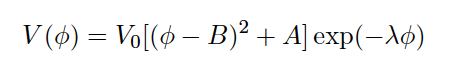

# Early_DE
Files that incorporate an Early Dark Energy component
(EDE) into the cosmological equations.

This code subsitutes the standard cosmological constant by an 
EDE component, which has the property to contribute to the
total density of the Universe even at high redshifts.
In a previous paper, [arXiv:1411.1074](http://arxiv.org/abs/1411.1074), 
we explored the [Doran & Robbers](http://arxiv.org/abs/astro-ph/0601544)
parameterization as a candidate of EDE. Now, considering a more general
picture we have incorporated an scalar field with potential

### Python Code

`QuintCosmology.py` is part of the [SimpleMC](https://github.com/ja-vazquez/SimpleMC) 
code used for cosmological parameter estimation.

### F90 Code
`equation_quint.F90` could be integrated into the standard CAMB package to 
compute EDE contributions and its perturbations.
The main module to bear in mind is `Quint_init_background`.

Both files, py and F90, produce the same results at the background level:

 

